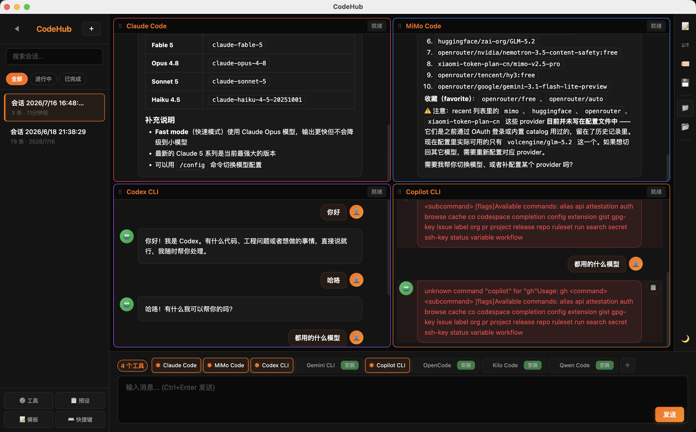
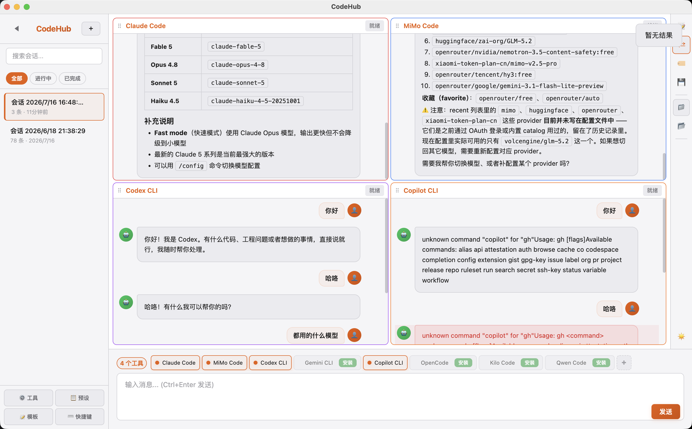

# CodeHub

Send the same message to multiple AI coding tools simultaneously, execute in parallel, and compare results — all in one desktop app.





[中文说明](#中文说明)

## Features

### Core
- **Multi-tool parallel dispatch** — Send one message to 8+ AI coding tools at once; results stream in as each tool finishes
- **Real-time streaming** — Watch each tool's response as it's generated
- **Side-by-side comparison** — Compare outputs from different tools in one view
- **Artifact tracking** — Automatically detects file changes (created/modified/deleted) after tool execution
- **Session management** — Save, load, search, and export conversation history (Markdown / JSON)
- **Message templates** — Built-in templates (explain code, code review, refactor, write tests, debug)
- **Custom tools** — Add any CLI command or HTTP API as a new tool

### UI/UX
- **Dark / Light mode** — One-click toggle, remembers your preference, follows system setting on first launch
- **Markdown rendering** — Full Markdown support with syntax highlighting for 15+ languages
- **Tool-colored panels** — Each tool gets its own border color with a breathing animation while running
- **Compact layout** — Right-side action rail, inline send button, collapsible presets — maximizes conversation area
- **Drag-to-reorder** — Rearrange tool panels by dragging
- **Timing stats** — Each panel shows response time and output length

### Interaction
- **Retry failed tools** — One-click retry on individual tool panels
- **Collapsible errors** — Long error messages are collapsed with an expand toggle
- **File drag & drop** — Drag file paths directly into the input area
- **Large output handling** — Auto-truncates at 8k characters with a "show all" button
- **Session search** — Search by session name, tags, or conversation content
- **Tool presets** — Save common tool combinations for one-click switching
- **Session tags** — Tag sessions for categorization (`#frontend`, `#debug`, etc.)

### Keyboard Shortcuts
| Shortcut | Action |
|----------|--------|
| `Ctrl+Enter` | Send message |
| `Ctrl+N` | New session |
| `Ctrl+K` | Search sessions |
| `Ctrl+B` | Toggle sidebar |
| `/` | Focus search |

## Supported Tools

| Tool | Command | Install |
|------|---------|---------|
| Claude Code | `claude` | [docs.anthropic.com](https://docs.anthropic.com/claude-code) |
| MiMo Code | `mimo` | [github.com/XiaomiMiMo/MiMo-Code](https://github.com/XiaomiMiMo/MiMo-Code) |
| Codex CLI | `codex` | [github.com/openai/codex](https://github.com/openai/codex) |
| Gemini CLI | `gemini` | [github.com/google-gemini/gemini-cli](https://github.com/google-gemini/gemini-cli) |
| Copilot CLI | `gh copilot` | [github.com/features/copilot](https://github.com/features/copilot) |
| OpenCode | `opencode` | [github.com/opencode-ai/opencode](https://github.com/opencode-ai/opencode) |
| Kilo Code | `kilo` | [github.com/Kilo-Org/kilocode](https://github.com/Kilo-Org/kilocode) |
| Qwen Code | `qwen` | [help.aliyun.com](https://help.aliyun.com/zh/model-studio/) |

Uninstalled tools show as "Not installed" and are silently skipped — no impact on other tools.

## Quick Start

### Prerequisites

- [Node.js](https://nodejs.org/) 18+
- At least one AI coding tool from the table above

### Install & Run

```bash
git clone https://github.com/yourname/codehub.git
cd codehub
npm install

# Launch
npm start

# Development mode (auto-opens DevTools)
npm run dev
```

### Build

```bash
npm run build          # macOS (.dmg)
npm run build:win     # Windows (.exe)
npm run build:linux    # Linux (.AppImage)
```

Build output goes to `dist/`.

## Usage

1. Pick tools from the bottom tool bar (checkboxes)
2. Optionally select a working directory (📁 button on the right rail)
3. Type a message → `Ctrl+Enter` or click Send
4. Watch parallel outputs stream in from each tool
5. Click **⇄ Compare** to view results side by side
6. Click **📦 Artifacts** to inspect file changes

### Adding a Custom Tool

Click **⚙️ Tools** in the sidebar → fill in:

- **CLI tool**: name + command (e.g. `python3`) + optional args
- **HTTP tool**: name + URL + endpoint path (default `/chat`)

Custom tools are saved to `~/Library/Application Support/codehub/custom-tools.json`.

## Architecture

```
src/
├── main.js                # Electron main process
├── preload.js             # Secure context bridge
├── ipc-channels.js        # IPC channel constants
├── ipc-handlers.js        # All IPC handlers
├── session-manager.js     # Session persistence + LRU cache
├── file-tracker.js        # File change detection (snapshot + diff)
├── core/
│   ├── adapters.config.js # Tool config table ← add new tools here
│   ├── adapter.js         # Config-driven adapter factory
│   ├── transport.js       # CLI / HTTP transport layer
│   ├── parser.js          # Output parsers (Claude / MiMo / Codex / plain text)
│   ├── registry.js        # Adapter registry
│   └── router.js          # Tool stop control
├── components/
│   ├── modal.js           # Modal management
│   ├── toast.js           # Toast notifications
│   └── diff-viewer.js     # Result comparison view
└── renderer/
    ├── index.html         # UI structure
    ├── app.js             # Entry point + event binding
    ├── state.js           # Global state
    ├── tools.js           # Tool selector + panel management
    ├── messages.js        # Message sending + Markdown rendering
    ├── output.js          # Output panel layout + streaming
    ├── sessions.js        # Session sidebar
    ├── modals.js          # Modal logic
    ├── base.css           # CSS variables (dark/light themes)
    ├── sidebar.css        # Sidebar styles
    ├── panels.css         # Panel + action rail styles
    ├── input.css          # Input area styles
    └── modals.css         # Modal styles
```

### Config-driven design

Adding a new AI tool requires **one entry** in `adapters.config.js`:

```js
{
  id: 'my-tool',
  name: 'My Tool',
  command: 'my-tool',
  args: ['--json'],
  messageAsArg: true,
  parser: 'text',
  installCommand: 'npm install -g my-tool',
  installUrl: 'https://example.com',
}
```

No changes to adapter, transport, parser, or registry code.

## Testing

```bash
npm test
```

80 unit tests covering:
- Parsers (Claude / MiMo / Codex / plain text / streaming buffer)
- Transport (CLI stdin/arg modes, HTTP, process lifecycle)
- Session manager (CRUD, LRU cache, search)
- File tracker (create/modify/delete detection, depth limit)
- IPC handlers (security: command injection, path traversal)
- Adapter config validation
- Retry logic (timeout, EPIPE, ENOENT classification)

## Data Storage

| Data | Path |
|------|------|
| Sessions | `~/Library/Application Support/codehub/sessions/` |
| Custom tools | `~/Library/Application Support/codehub/custom-tools.json` |
| Presets | `~/Library/Application Support/codehub/presets.json` |
| Templates | `~/Library/Application Support/codehub/templates.json` |
| Window state | `~/Library/Application Support/codehub/window-state.json` |

## Tech Stack

- **Electron 35** — cross-platform desktop framework
- **Pure JavaScript (CommonJS)** — zero runtime dependencies
- **electron-builder** — packaging for macOS / Windows / Linux
- **marked + highlight.js** — Markdown rendering with syntax highlighting
- **Node test runner** — built-in `node --test`, no test framework needed

## Contributing

1. Fork the repo
2. Add your tool to `src/core/adapters.config.js`
3. Run `npm test` to verify nothing breaks
4. Submit a PR

## License

[MIT](LICENSE)
